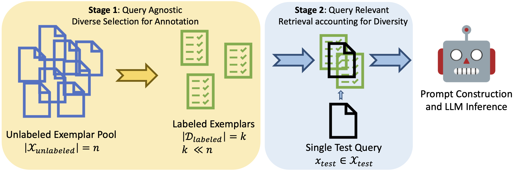

# An End-to-End Submodular Framework for Data-Efficient In-Context Learning (NAACL 2024)

## Abstract

Recent advancements in natural language tasks leverage the emergent In-Context Learning (ICL) ability of pretrained Large Language Models (LLMs). ICL enables LLMs to perform new tasks by utilizing a limited number of input-output examples as prompts. While ICL circumvents the costly step of finetuning LLMs, its effectiveness is heavily dependent on the quality and ordering of provided examples (called exemplars). In this work, we propose a two-stage data-efficient framework Div-S3 for exemplar selection for ICL. The first stage focuses on data annotation and employs a pool-based active learning approach to select a set of Diverse and informative exemplars from the target tasks’ unlabeled pool. Given a test input/query, the second stage uses Submodular Span Summarization (S3) to select the most relevant and non-redundant exemplars from the annotated pool of a limited budget. On 7 different NLP datasets and 5 LLMs of varying complexities, we show Div-S3 outperforms (1) existing active learning-based methods for data annotation for ICL and (2) similarity-based methods for test query-specific exemplars retrieval.


<p align="center" width="40%">
<a ></a>
</p>

# Running Experiments

### Datasets covered: 
sst5, mrpc, dbpedia_14, mnli, rte, hellaswag, sst2, trec

### Stage 1 methods for exemplar annotation:
- **Random**: randomly select exemplars from the pool. Set `args.stage_1` to `random`
- **Vote-k**: selects the top k/10 diverse samples based on feature space, while the inference LLM selects the remaining 9k/10 samples using average log probability for confidence-based diversity. Set `args.stage_1` to `fast-votek`
- **Emb-distance**: selects the unlabeled sample with the largest total cosine distance from the already labeled set to maximize diversity within the annotation budget. Set `args.stage_1` to `mdiv`
- **Div**erse: selects a diverse and representative set of samples to comprehensively cover the target task space using submodular greedy algorithm. Set `args.stage_1` to `subm-fl-greedy`

### Stage 2 methods for exemplar retrieval:
- **Random**: randomly select exemplars from the annotated pool. Set `args.stage_2` to `random`
- **Similar**: uses cosine similarity-based ranking to extract the most relevant exemplars at test time. Set `args.stage_2` to `similar`
- **Mixture of submodular functions**: uses a mixture of submodular function (facility location) and a modular function (similarity scores) to balance representativeness and query-relevance in the retrieved set. Set `args.stage_2` to `mixmodsub`
- **Submodular Span Summarization (S3)**: uses submodular span summarization to select the most relevant and non-redundant exemplars from the annotated pool. Set `args.stage_2` to `sspan`

### Example commands to run experiments:
Set `annotation_size` to -1 to test stage 2 methods without imposing any annotation constraint. This will bypass the active learning-based exemplar annotation process (Stage 1).

```bash
python main.py --task_name sst5 --num_eval -1 --num_train -1 --stage_1 subm-fl-greedy --stage_2 sspan --annotation_size 100 --seed 0 --fl_sim_metric cos1

python main.py --task_name sst5 --num_eval -1 --num_train -1 --stage_2 sspan --annotation_size -1 --seed 0 --fl_sim_metric cos1
```


## Acknowledgements
We sincerely thank the authors of the following repositories for sharing their code publicly
- Vote-k: https://github.com/xlang-ai/icl-selective-annotation


## Citation
Please cite our paper if you find the repo helpful in your work:

```bibtex
@inproceedings{kumari2024end,
  title={An End-to-End Submodular Framework for Data-Efficient In-Context Learning},
  author={Kumari, Lilly and Wang, Shengjie and Das, Arnav and Zhou, Tianyi and Bilmes, Jeff},
  booktitle={Findings of the Association for Computational Linguistics: NAACL 2024},
  pages={3293--3308},
  year={2024}
}
```


## Questions?
For Div-S3 related questions, contact [Lilly](lkumari@uw.edu)  </br>